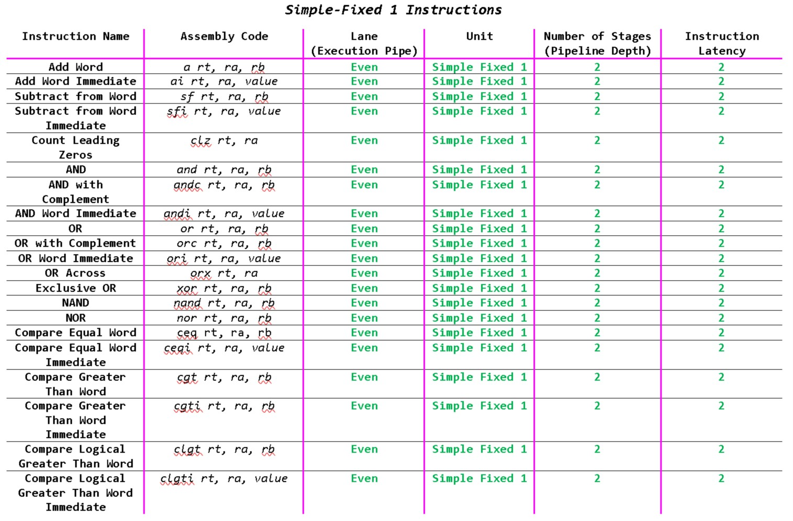
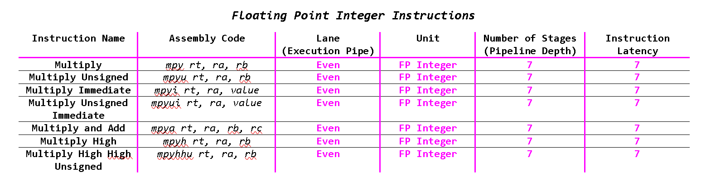
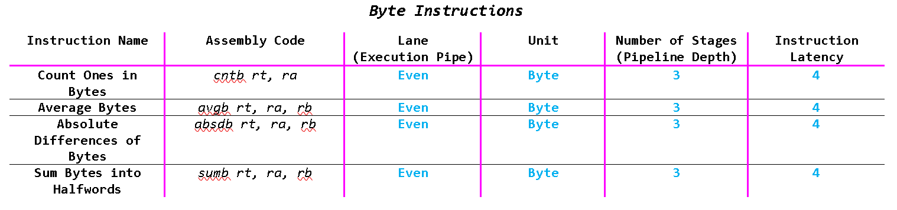
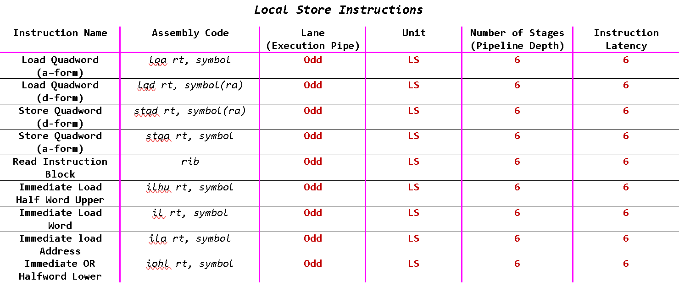
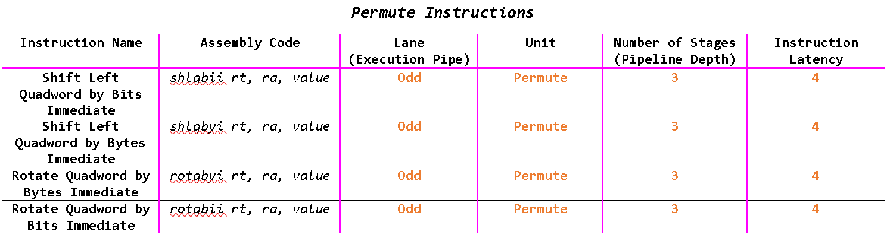
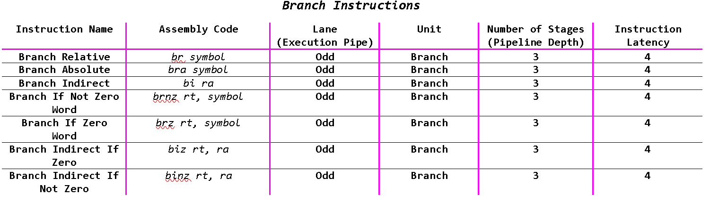
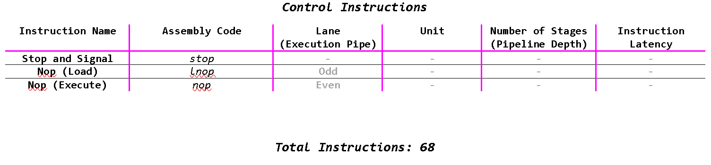

#  SPU Assembler

> Assembler for a specific subset of Instructions of the Sony Cell SPU.

## Instruction Subset










## Test all instructions
```
$ make all
$ bin/assembler < rsrc/test.asm > output/data
```
### Input file: Test.asm
```
# Test all Instructions
LQA 127, 0xFFFF
lqd 127, 0x3FF(127)
stqd 127, 0x3FF(127)
stqa 127, 0xFFFF
rib
ilhu 127, 0xFFFF
il 127, 0xFFFF
ila 127, 0x3FFFF
iohl 127, 0xFFFF
a 127, 126, 125
ai 127, 126, 0x3FF
sf 127, 126, 125
sfi 127, 126, 0x3FF
clz 127, 126
and 127, 126, 125
andc 127, 126, 125
andi 127, 126, 0x3FF
or 127, 126, 125
orc 127, 126, 125
ori 127, 126, 0x3FF
orx 127, 126
xor 127, 126, 125
NAND 127, 126, 125
nor 127, 126, 125               
ceq 127, 126, 125
ceqi 127, 126, 0x3FF
cgt 127, 126, 125
cgti 127, 126, 0x3FF
clgt 127, 126, 125
clgti 127, 126, 0x3FF         
mpy 127, 126, 125
mpyu 127, 126, 125
mpyi 127, 126, 0x3FF
mpyui 127, 126, 0x3FF
mpya 127, 126, 125, 127
mpyh 127, 126, 125
mpyhhu 127, 126, 125
cntb 127, 126
avgb 127, 126, 125
absdb 127, 126, 125
sumb 127, 126, 125
shlqbii 127, 126, 125
shlqbyi 127, 126, 125
rotqbyi 127, 126, 125
rotqbii 127, 126, 125
shli 127, 126, 125
rothi 127, 126, 125
roti 127, 126, 125
br 0xFFFF
bra 0xFFFF
bi 127
brnz 127, 0xFFFF
brz 127, 0xFFFF
biz 127, 126
binz 127, 126
fa 127, 126, 125
fs 127, 126, 125
fm 127, 126, 125
fma 127, 126, 125, 127
fnms 127, 126, 125, 127
fms 127, 126, 125, 127
fceq 127, 126, 125
fcmeq 127, 126, 125
fcgt 127, 126, 125
fcmgt 127, 126, 125
stop
lnop
NOP
```
### Output file: data
```
0x30FFFFFF
0x34FFFFFF
0x24FFFFFF
0x20FFFFFF
0x47FFFF80
0x417FFFFF
0x40FFFFFF
0x43FFFFFF
0x60FFFFFF
0x181F7F7F
0x1CFFFF7F
0x081F7F7F
0x0CFFFF7F
0x54A03F7F
0x183F7F7F
0x583F7F7F
0x14FFFF7F
0x083F7F7F
0x593F7F7F
0x04FFFF7F
0x3E003F7F
0x483F7F7F
0x193F7F7F
0x093F7F7F
0x781F7F7F
0x7CFFFF7F
0x481F7F7F
0x4CFFFF7F
0x581F7F7F
0x5CFFFF7F
0x789F7F7F
0x799F7F7F
0x74FFFF7F
0x75FFFF7F
0xCFFFFEFE
0x78BF7F7F
0x79DF7F7F
0x56803F7F
0x1A7F7F7F
0x0A7F7F7F
0x4A7F7F7F
0x3F7F7F7F
0x3FFF7F7F
0x3F9F7F7F
0x3F1F7F7F
0x0F7F7F7F
0x0F9F7F7F
0x0F1F7F7F
0x327FFF80
0x307FFF80
0x35003F80
0x217FFFFF
0x207FFFFF
0x25003F7F
0x25203F7F
0x589F7F7F
0x58BF7F7F
0x58DF7F7F
0xEFFFFEFE
0xDFFFFEFE
0xFFFFFEFE
0x785F7F7F
0x795F7F7F
0x585F7F7F
0x595F7F7F
0x00000000
0x00200000
0x40200000
```

The input file has all the Instructions with arbitrary operands.  
The output file produceds the 32-bit hex values of each instruction.
